# Atlas800-9000 训练服务器环境配置

## 一、安装 miniconda

（1）官网安装网站步骤：https://docs.conda.io/projects/miniconda/en/latest/index.html#quick-command-line-install
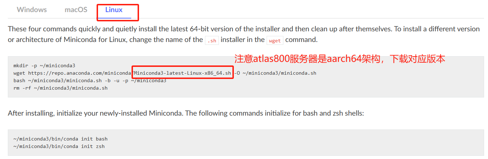
（2）版本选择网站：https://docs.conda.io/projects/miniconda/en/latest/miniconda-hashes.html

conda base 环境的 python 版本可以随便选择
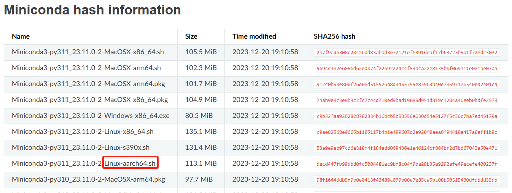
（3）命令行安装
```
创建安装路径
mkdir -p ~/miniconda3

# 下载挑选的安装包，注意对应系统架构的miniconda版本
wget https://repo.anaconda.com/miniconda/Miniconda3-py311_23.11.0-2-Linux-aarch64.sh -O ~/miniconda3/miniconda.sh
# 安装
bash ~/miniconda3/miniconda.sh -b -u -p ~/miniconda3

# 删除安装包
rm -rf ~/miniconda3/miniconda.sh

conda初始化
~/miniconda3/bin/conda init bash

# 新建终端激活 conda 的 base  环境
```

## 二、conda 管理 python 环境
(1) 修改 conda 源
```
# 创建 conda 镜像管理文件
vim ~/.condarc

# 添加国内镜像源
channels:
  - https://mirrors.tuna.tsinghua.edu.cn/anaconda/pkgs/free/
  - https://mirrors.tuna.tsinghua.edu.cn/anaconda/cloud/menpo/
  - https://mirrors.tuna.tsinghua.edu.cn/anaconda/cloud/bioconda/
  - https://mirrors.tuna.tsinghua.edu.cn/anaconda/cloud/msys2/
  - https://mirrors.tuna.tsinghua.edu.cn/anaconda/cloud/conda-forge/
  - https://mirrors.tuna.tsinghua.edu.cn/anaconda/pkgs/main/
  - https://mirrors.ustc.edu.cn/anaconda/pkgs/main/
  - https://mirrors.ustc.edu.cn/anaconda/pkgs/free/
  - https://mirrors.ustc.edu.cn/anaconda/cloud/conda-forge/
  - https://mirrors.ustc.edu.cn/anaconda/cloud/msys2/
  - https://mirrors.ustc.edu.cn/anaconda/cloud/bioconda/
  - https://mirrors.ustc.edu.cn/anaconda/cloud/menpo/
  - defaults
show_channel_urls: true

# 新建终端，激活 conda 镜像源
```

## 三、Atlas 800 服务器裸机安装 PyTorch1.11.0 训练环境
（1）安装前**必看**两个章节：

https://www.hiascend.com/document/detail/zh/CANNCommunityEdition/700alpha003/softwareinstall/instg/instg_0001.html

https://www.hiascend.com/document/detail/zh/ModelZoo/pytorchframework/ptes/ptes_00001.html

（2）安装流程
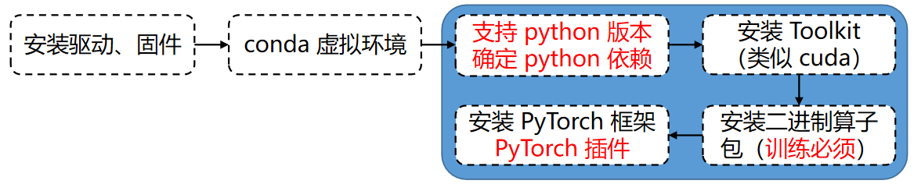

**1.** 驱动及固件版本确定（服务器系统**已安装**，无需安装）

https://support.huawei.com/enterprise/zh/doc/EDOC1100332515/51429589
```
# 查看驱动加载是否成功
npu-smi info
```
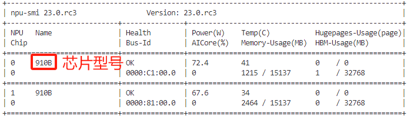  
```
# 查看芯片固件版本号
sudo /usr/local/Ascend/driver/tools/upgrade-tool --device_index -1 --component -1 --version
```
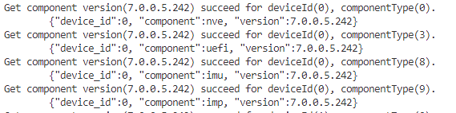

**2.** 确定 python 版本（以 **python3.8.2** 为例）

https://www.hiascend.com/document/detail/zh/ModelZoo/pytorchframework/ptes/ptes_00007.html
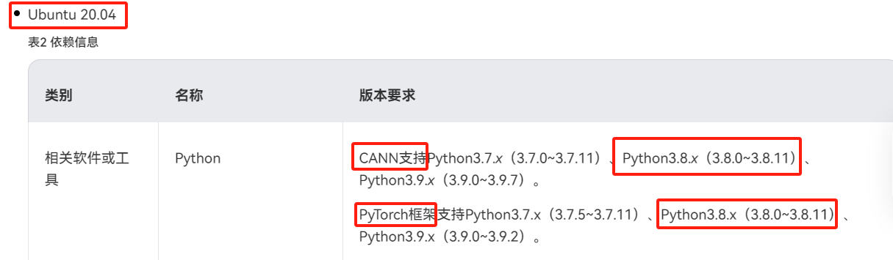

**3.** conda 创建环境及安装相关依赖（非管理员**慎用 apt 等工具**直接升级或降级已有的安装）

https://www.hiascend.com/document/detail/zh/ModelZoo/pytorchframework/ptes/ptes_00007.html

**相关软件或工具：**

一个个查看依赖版本即可，一般不用安装，**服务器管理员会安装**

**OS依赖：**

查看是否安即可，一般不用安装，**服务器管理员会安装(如 cmake 等已满足要求，后续无需再安装！！！)**

https://www.hiascend.com/document/detail/zh/ModelZoo/pytorchframework/ptes/ptes_00010.html

**python依赖（建议使用 conda 管理）**

```
# 创建 python 环境（默认 conda 源可以没有 python3.8.2 版本，需要添加国内源）
conda create -n pytorch1.11.0 python=3.8.2

# 激活 conda 环境
conda activate pytorch1.11.0 

# 安装 python 依赖（将相关依赖放到 requirements.txt 文件）
pip install -r requirements.txt

>>> requirements.txt 文件内容:
numpy>=1.14.3
decorator>=4.4.0
sympy>=1.4
cffi>=1.12.3
protobuf>=3.11.3
attrs
cython
pyyaml
pathlib2
scipy
requests
psutil
absl-py
```
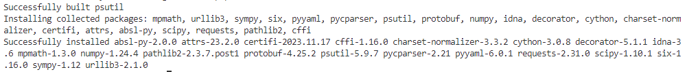


**4.** 安装 Toolkit 开发套件（社区版）

https://www.hiascend.com/developer/download/community/result?module=cann&cann=7.0.0.alpha003
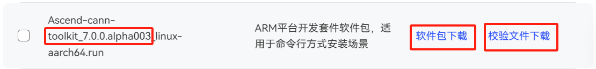

注意需要下载**校验文件**，按照步骤进行校验即可
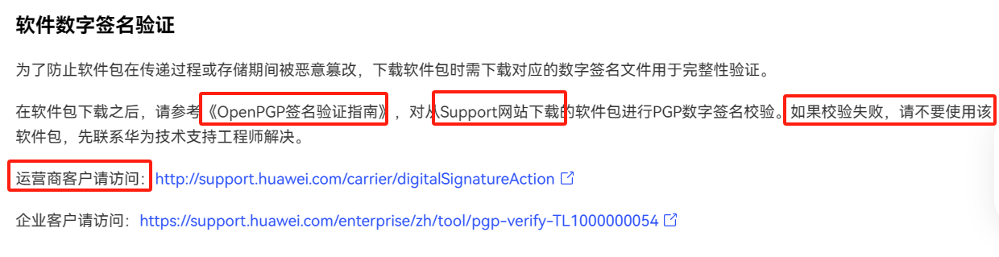
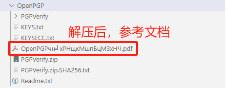
```
# 切换目录到 PGPVerify.jar 的目录
java -jar PGPVerify.jar -f ~/download/Ascend-cann-toolkit_7.0.0.alpha003_linux-aarch64.run.asc

# 安装包校验成果结果如下
```
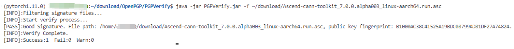

安装参考链接：https://www.hiascend.com/document/detail/zh/CANNCommunityEdition/700alpha003/softwareinstall/instg/instg_0038.html

```
# 添加可执行权限
chmod +x Ascend-cann-toolkit_7.0.0.alpha003_linux-aarch64.run

# 校验软件包安装文件的一致性和完整性
./Ascend-cann-toolkit_7.0.0.alpha003_linux-aarch64.run --check

# 安装
./Ascend-cann-toolkit_7.0.0.alpha003_linux-aarch64.run --install

# 根据安装成功提示信息，配置环境到 ~/.bashrc 文件，并执行以下命令生效
source ~/.bashrc
```

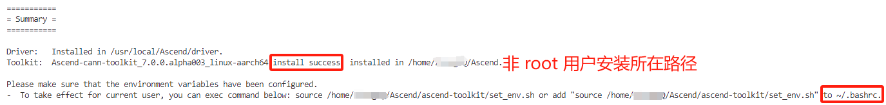

**5.** 安装二进制算子包（**训练必须**）

安装步骤和安装 Toolkit 开发套件一样，只是下载的安装包不一样（注意版本的一致性）


```
# 切换目录到 PGPVerify.jar 的目录
java -jar PGPVerify.jar -f ~/download/Ascend-cann-kernels-910b_7.0.0.alpha003_linux.run.asc

# 安装包校验成果结果如下
```
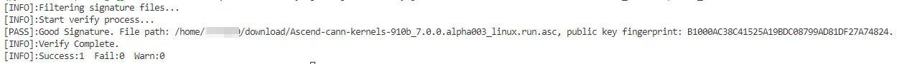
```
# 添加可执行权限
chmod +x Ascend-cann-kernels-910b_7.0.0.alpha003_linux.run

# 校验软件包安装文件的一致性和完整性
./Ascend-cann-kernels-910b_7.0.0.alpha003_linux.run --check

# 安装
./Ascend-cann-kernels-910b_7.0.0.alpha003_linux.run --install

# 检查路径，是否安装成功（安装成功有对应路径）
ls ~/Ascend/ascend-toolkit/7.0.0.alpha003/opp/built-in/op_impl/ai_core/tbe/kernel
```
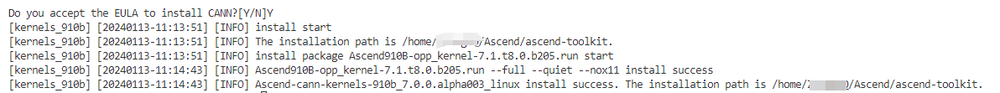

**6.** 安装 PyTorch 训练框架（**！！！注意软件的配套使用**）

参考链接：https://www.hiascend.com/document/detail/zh/CANNCommunityEdition/700alpha003/softwareinstall/instg/instg_0046.html
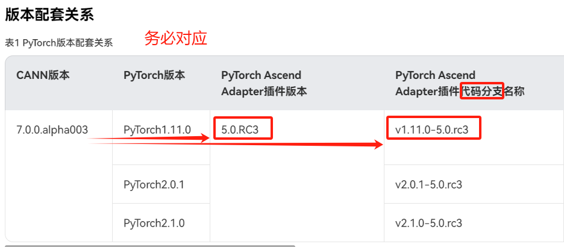
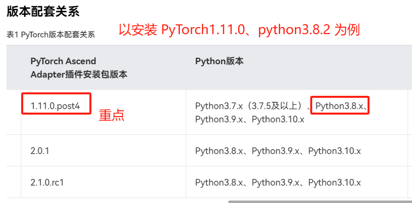

a.安装 PyTorch1.11.0
```
# 获取对应版本的 .whl 包
wget https://download.pytorch.org/whl/torch-1.11.0-cp38-cp38-manylinux2014_aarch64.whl

# 在对应 conda 环境下安装
pip install torch-1.11.0-cp38-cp38-manylinux2014_aarch64.whl
```
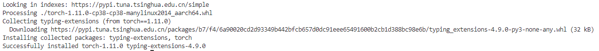

b.安装 torch_npu 插件（对应插件安装包为 1.11.0.post4）

版本下载链接：https://www.hiascend.com/developer/download/community/result?module=pt+cann&pt=5.0.0.alpha003&cann=7.0.0.alpha003
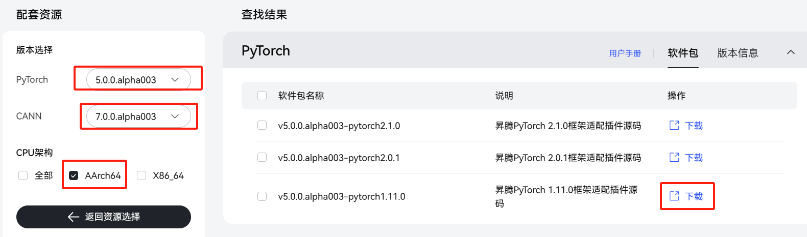
```
# 克隆匹配的版本（无对应 python 版本，则需要源码编译）
wget https://gitee.com/ascend/pytorch/releases/download/v5.0.rc3-pytorch1.11.0/torch_npu-1.11.0.post4-cp38-cp38-linux_aarch64.whl

# 安装
pip3 install torch_npu-1.11.0.post4-cp38-cp38-linux_aarch64.whl

# 安装对应版本的 torchvision
pip3 install torchvision==0.12.0

# 验证安装是否成功
python3 -c "import torch;import torch_npu; a = torch.randn(3, 4).npu(); print(a + a);"
```
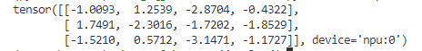

c.安装 APEX 模块

参考链接：https://www.hiascend.com/document/detail/zh/CANNCommunityEdition/700alpha003/softwareinstall/instg/instg_0050.html

源码分支确定（master 分支查看）：https://gitee.com/ascend/apex/tree/master/

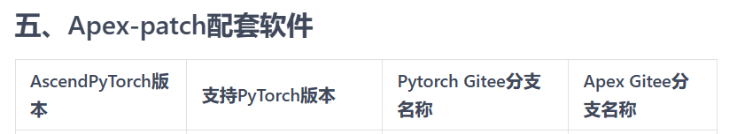
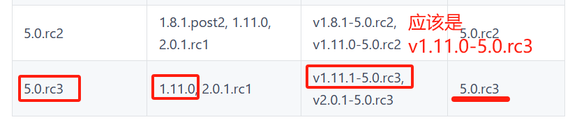

```
# 降级 setuptools 版本
pip3 install setuptools==65.7.0

# 获取 APEX 源码（PyTorch1.11.0-5.0.rc3）
git clone -b 5.0.rc3 https://gitee.com/ascend/apex.git

# 进入克隆下来的分支查看 README.zh.md 进行安装
cd apex/
bash scripts/build.sh --python=3.8
cd apex/dist/
pip3 uninstall apex
pip3 install --upgrade apex-0.1_ascend-cp38-cp38-linux_aarch64.whl
```
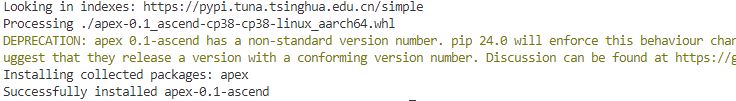

d.环境安装验证

参考链接：https://www.hiascend.com/document/detail/zh/CANNCommunityEdition/700alpha003/ptmoddevg/ptmigr/AImpug_0002.html
```
# 执行程序验证是否可用
python test.py
```
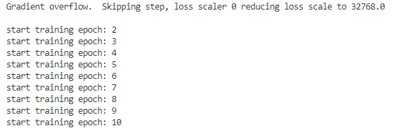


## conda 管理环境 Q&A

**（1）pip 安装的依赖在当前 python 环境不生效**
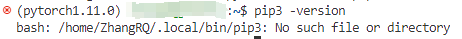

原因是当前用户在没有安装 conda 前本地安装了 python 环境，在 ~/.local 路径下，可以将相关的 python 目录和 ~/.pip 删除，然后新建终端初始化 pip 环境。（切忌不能参考网络上彻底卸载 python 的方法，尤其是涉及到 sudo 权限的卸载，**/usr/local下的python环境不能卸载**）
